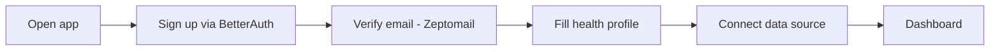
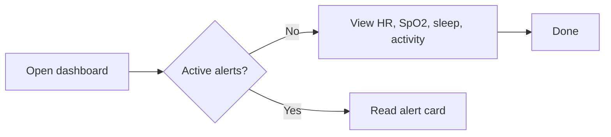
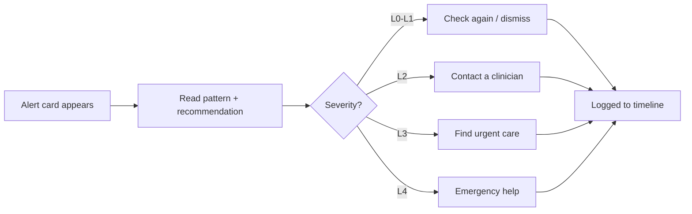
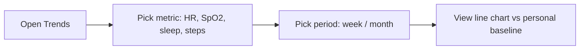

# Phase 0.1 — User Flows

Persona: Health-Conscious Alex. One loop: connect → see → alerted → act → track.

## Flow 1 — Onboarding + connect source

Steps: sign up → verify email → health profile (conditions, meds, pregnancy/menstrual
where relevant) → connect source (simulated in V1, no manual entry) → land on dashboard.
Exit: dashboard shows today's metrics.

## Flow 2 — Daily check (dashboard)

Exit: Alex sees today's snapshot in under 3 seconds.

## Flow 3 — Alert → action

Copy rule: explain pattern + uncertainty + next action. Never a diagnosis.
Every action is logged to the health timeline.

## Flow 4 — Trends

Exit: chart renders from `GET /history`.
